# Leadde Knowledge in Motion

Short educational animations with concept explanations and versioned reuse materials.

**345 video-ready · 39 recorded review passes · 137 awaiting production · 43 courses · 17 disciplines**

Video-ready means a file is available. Review passes require version-specific evidence; historical videos are not automatically approved.

## Featured videos

<table>
<tr>
<td width="33%" valign="top">
<a href="catalog/computer-science/6-006.md#c02-a001">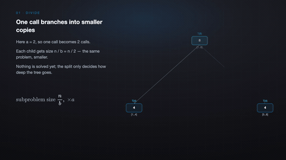</a> 
<a href="catalog/computer-science/6-006.md#c02-a001"><strong>Divide and conquer recursion</strong></a> 
Read a divide-and-conquer recurrence as a recursion tree. 
<a href="catalog/computer-science/6-006.md#c02-a001">▶ Watch full video</a> · <a href="docs/verification/featured-inspection.md">Inspection scope</a>
</td>
<td width="33%" valign="top">
<a href="catalog/artificial-intelligence/ai-rl.md#c29-a001">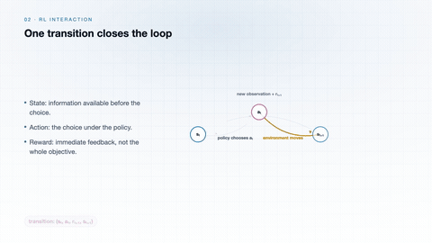</a> 
<a href="catalog/artificial-intelligence/ai-rl.md#c29-a001"><strong>States, Actions, and Rewards</strong></a> 
Distinguish state, action and reward in an interaction loop. 
<a href="catalog/artificial-intelligence/ai-rl.md#c29-a001">▶ Watch full video</a> · <a href="docs/verification/featured-inspection.md">Inspection scope</a>
</td>
<td width="33%" valign="top">
<a href="catalog/mathematics/18-06.md#c05-a014">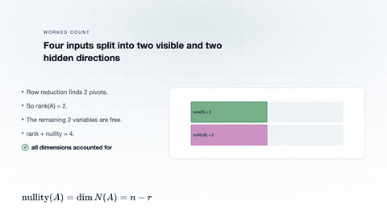</a> 
<a href="catalog/mathematics/18-06.md#c05-a014"><strong>Rank-Nullity Theorem</strong></a> 
Account for all input dimensions using rank and nullity. 
<a href="catalog/mathematics/18-06.md#c05-a014">▶ Watch full video</a> · <a href="docs/verification/featured-inspection.md">Inspection scope</a>
</td>
</tr>
</table>

Looping GIF excerpts from the actual videos. Click a card to watch the full video and access its Prompt.

## Watch, download, reuse

- **Watch:** [Browse the concept index](catalog/INDEX.md) and play native videos on course pages.
- **Download:** [Course packages](https://github.com/LeaddeOpenLab/leadde-knowledge-in-motion/releases/tag/course-video-downloads). Each package includes a version index and reuse notes when available.
- **Reuse:** Open the expandable Prompt on a course page. Check its alignment and source availability before adapting it.

## Browse the library

<table>
<tr>
<td width="33%" valign="top">
 
<a href="#computer-science"><strong>Computer Science</strong></a> 
10 courses · 115 videos · 0 awaiting production
</td>
<td width="33%" valign="top">
 
<a href="#artificial-intelligence"><strong>Artificial Intelligence</strong></a> 
7 courses · 107 videos · 0 awaiting production
</td>
<td width="33%" valign="top">
 
<a href="#mathematics"><strong>Mathematics</strong></a> 
7 courses · 68 videos · 0 awaiting production
</td>
</tr>
<tr>
<td width="33%" valign="top">
 
<a href="#mathematics-statistics"><strong>Mathematics &amp; Statistics</strong></a> 
1 courses · 12 videos · 0 awaiting production
</td>
<td width="33%" valign="top">
 
<a href="#physics"><strong>Physics</strong></a> 
2 courses · 0 videos · 25 awaiting production · No finished videos yet
</td>
<td width="33%" valign="top">
 
<a href="#chemistry"><strong>Chemistry</strong></a> 
1 courses · 14 videos · 0 awaiting production
</td>
</tr>
<tr>
<td width="33%" valign="top">
 
<a href="#life-sciences"><strong>Life Sciences</strong></a> 
1 courses · 0 videos · 12 awaiting production · No finished videos yet
</td>
<td width="33%" valign="top">
 
<a href="#neuroscience"><strong>Neuroscience</strong></a> 
1 courses · 0 videos · 10 awaiting production · No finished videos yet
</td>
<td width="33%" valign="top">
 
<a href="#psychology"><strong>Psychology</strong></a> 
1 courses · 0 videos · 13 awaiting production · No finished videos yet
</td>
</tr>
<tr>
<td width="33%" valign="top">
 
<a href="#economics"><strong>Economics</strong></a> 
3 courses · 0 videos · 31 awaiting production · No finished videos yet
</td>
<td width="33%" valign="top">
 
<a href="#finance"><strong>Finance</strong></a> 
1 courses · 0 videos · 12 awaiting production · No finished videos yet
</td>
<td width="33%" valign="top">
 
<a href="#political-science"><strong>Political Science</strong></a> 
1 courses · 0 videos · 14 awaiting production · No finished videos yet
</td>
</tr>
<tr>
<td width="33%" valign="top">
 
<a href="#philosophy"><strong>Philosophy</strong></a> 
1 courses · 0 videos · 10 awaiting production · No finished videos yet
</td>
<td width="33%" valign="top">
 
<a href="#literature"><strong>Literature</strong></a> 
1 courses · 0 videos · 10 awaiting production · No finished videos yet
</td>
<td width="33%" valign="top">
 
<a href="#astronomy"><strong>Astronomy</strong></a> 
1 courses · 12 videos · 0 awaiting production
</td>
</tr>
<tr>
<td width="33%" valign="top">
 
<a href="#embedded-systems"><strong>Embedded Systems</strong></a> 
2 courses · 8 videos · 0 awaiting production
</td>
<td width="33%" valign="top">
 
<a href="#digital-electronics"><strong>Digital Electronics</strong></a> 
2 courses · 9 videos · 0 awaiting production
</td>
<td></td>
</tr>
</table>

### Computer Science

115 videos · 0 awaiting production

<table>
<tr>
<td width="33%" valign="top">

 
<a href="catalog/computer-science/cs50x.md"><strong>Introduction to Computer Science</strong></a> 
16 videos · 0 awaiting production
</td>
<td width="33%" valign="top">

 
<a href="catalog/computer-science/6-006.md"><strong>Introduction to Algorithms</strong></a> 
14 videos · 0 awaiting production
</td>
<td width="33%" valign="top">

 
<a href="catalog/computer-science/cs-coa.md"><strong>Computer Organization and Architecture</strong></a> 
8 videos · 0 awaiting production
</td>
</tr>
<tr>
<td width="33%" valign="top">

 
<a href="catalog/computer-science/cs-os.md"><strong>Operating Systems</strong></a> 
8 videos · 0 awaiting production
</td>
<td width="33%" valign="top">

 
<a href="catalog/computer-science/cs-net.md"><strong>Computer Networks</strong></a> 
8 videos · 0 awaiting production
</td>
<td width="33%" valign="top">

 
<a href="catalog/computer-science/cs-db.md"><strong>Database Systems</strong></a> 
8 videos · 0 awaiting production
</td>
</tr>
<tr>
<td width="33%" valign="top">

 
<a href="catalog/computer-science/cs-comp.md"><strong>Compiler Design</strong></a> 
8 videos · 0 awaiting production
</td>
<td width="33%" valign="top">

<a href="catalog/computer-science/cloud-native-kubernetes.md">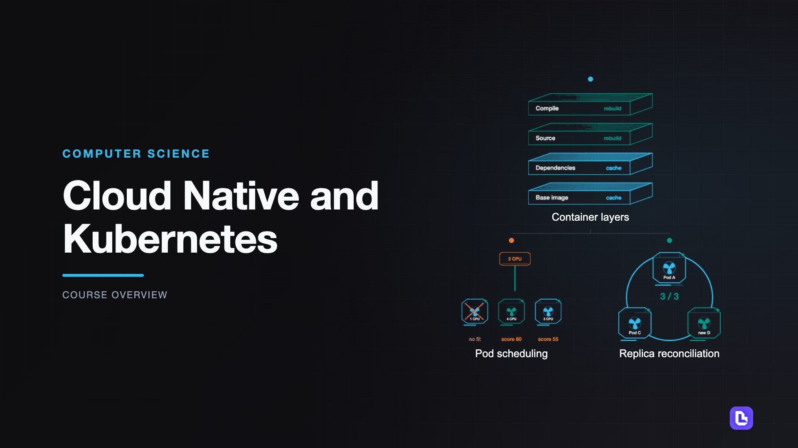</a> 
<a href="catalog/computer-science/cloud-native-kubernetes.md"><strong>Cloud Native and Kubernetes</strong></a> 
15 videos · 0 awaiting production
</td>
<td width="33%" valign="top">

<a href="catalog/computer-science/cybersecurity-and-identity-authentication.md">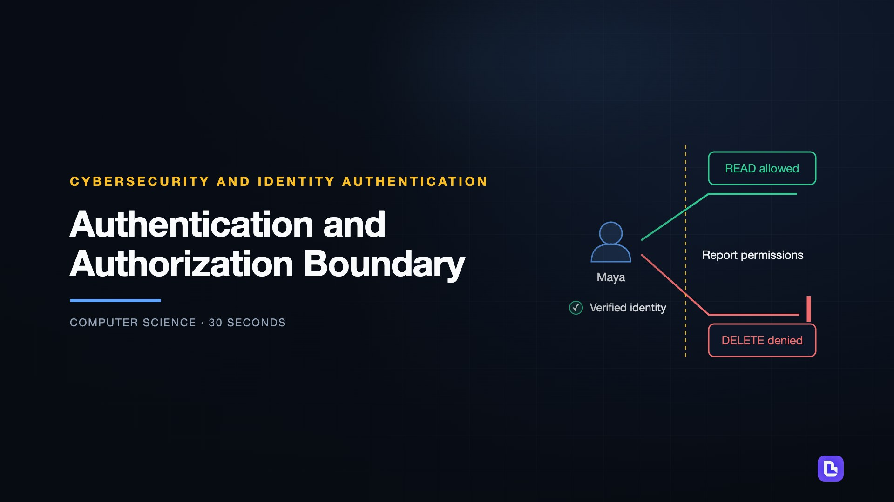</a> 
<a href="catalog/computer-science/cybersecurity-and-identity-authentication.md"><strong>Cybersecurity and Identity Authentication</strong></a> 
15 videos · 0 awaiting production
</td>
</tr>
<tr>
<td width="33%" valign="top">

<a href="catalog/computer-science/typescript-full-stack-development.md">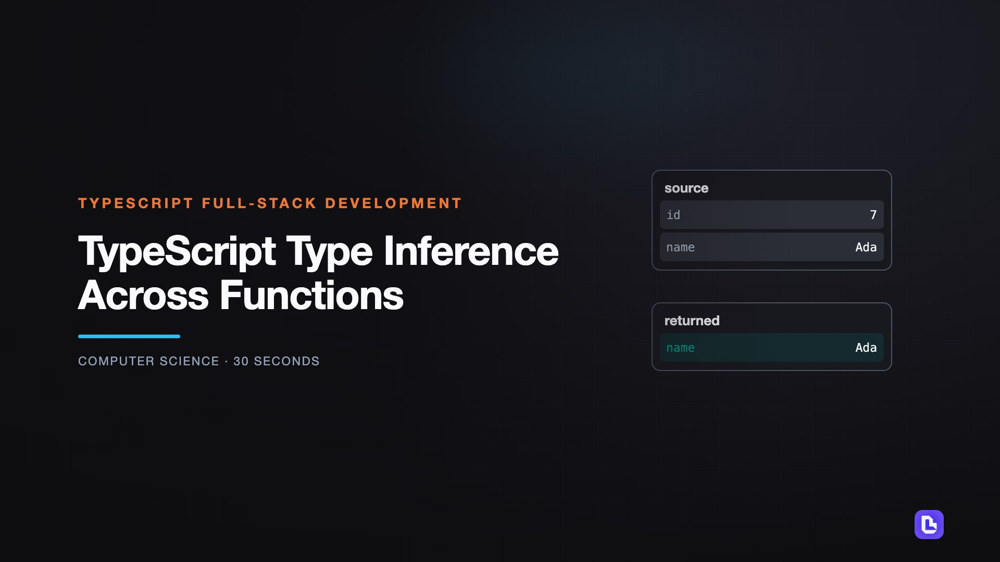</a> 
<a href="catalog/computer-science/typescript-full-stack-development.md"><strong>TypeScript Full-Stack Development</strong></a> 
15 videos · 0 awaiting production
</td>
<td></td>
<td></td>
</tr>
</table>

[Back to subject cards](#browse-the-library)

### Artificial Intelligence

107 videos · 0 awaiting production

<table>
<tr>
<td width="33%" valign="top">

 
<a href="catalog/artificial-intelligence/6-036.md"><strong>Introduction to Machine Learning</strong></a> 
20 videos · 0 awaiting production
</td>
<td width="33%" valign="top">

<a href="catalog/artificial-intelligence/ai-dl.md">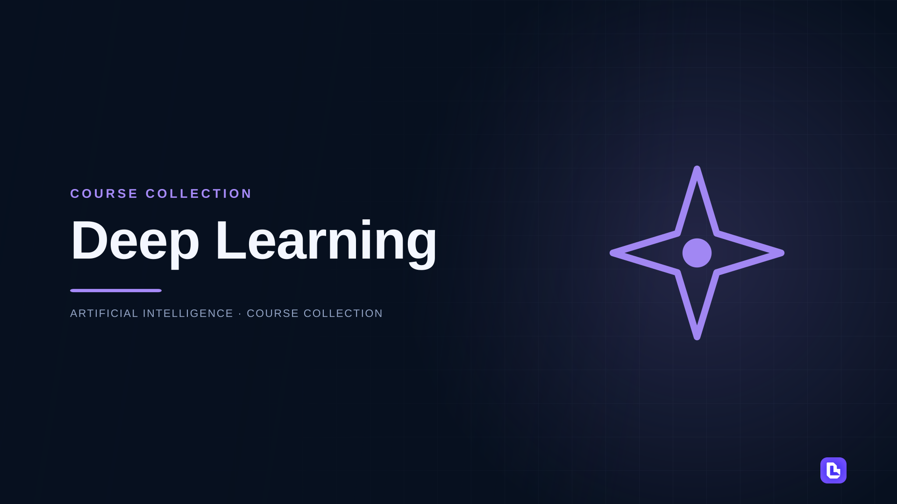</a> 
<a href="catalog/artificial-intelligence/ai-dl.md"><strong>Deep Learning</strong></a> 
25 videos · 0 awaiting production
</td>
<td width="33%" valign="top">

 
<a href="catalog/artificial-intelligence/ai-nlp.md"><strong>Natural Language Processing</strong></a> 
8 videos · 0 awaiting production
</td>
</tr>
<tr>
<td width="33%" valign="top">

 
<a href="catalog/artificial-intelligence/ai-cv.md"><strong>Computer Vision</strong></a> 
8 videos · 0 awaiting production
</td>
<td width="33%" valign="top">

 
<a href="catalog/artificial-intelligence/ai-rl.md"><strong>Reinforcement Learning</strong></a> 
8 videos · 0 awaiting production
</td>
<td width="33%" valign="top">

 
<a href="catalog/artificial-intelligence/ai-gen.md"><strong>Generative Artificial Intelligence</strong></a> 
23 videos · 0 awaiting production
</td>
</tr>
<tr>
<td width="33%" valign="top">

<a href="catalog/artificial-intelligence/ai-agent-systems.md">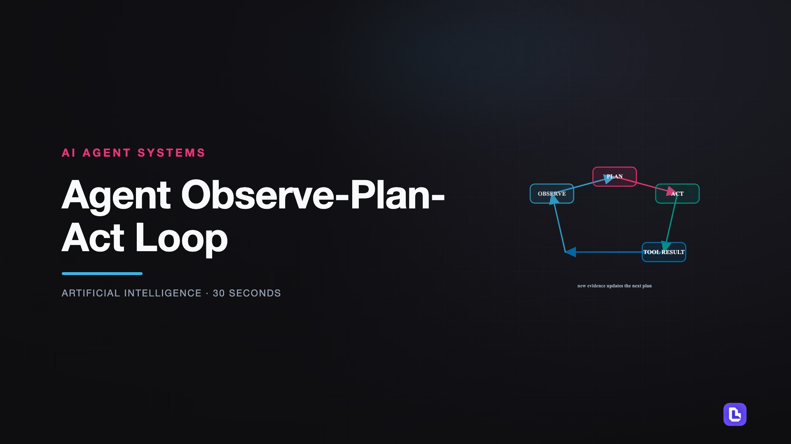</a> 
<a href="catalog/artificial-intelligence/ai-agent-systems.md"><strong>AI Agent Systems</strong></a> 
15 videos · 0 awaiting production
</td>
<td></td>
<td></td>
</tr>
</table>

[Back to subject cards](#browse-the-library)

### Mathematics

68 videos · 0 awaiting production

<table>
<tr>
<td width="33%" valign="top">

<a href="catalog/mathematics/18-01.md">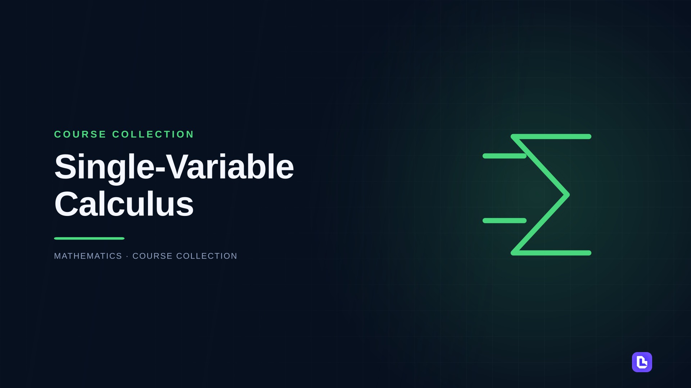</a> 
<a href="catalog/mathematics/18-01.md"><strong>Single-Variable Calculus</strong></a> 
12 videos · 0 awaiting production
</td>
<td width="33%" valign="top">

<a href="catalog/mathematics/18-06.md">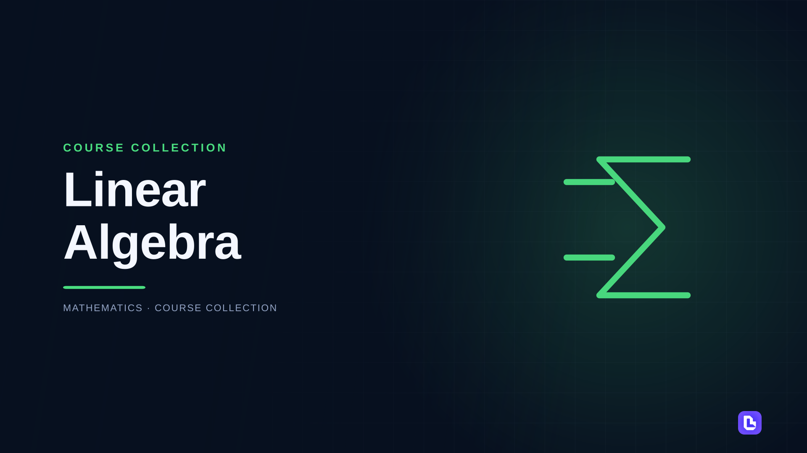</a> 
<a href="catalog/mathematics/18-06.md"><strong>Linear Algebra</strong></a> 
16 videos · 0 awaiting production
</td>
<td width="33%" valign="top">

<a href="catalog/mathematics/math-mvc.md">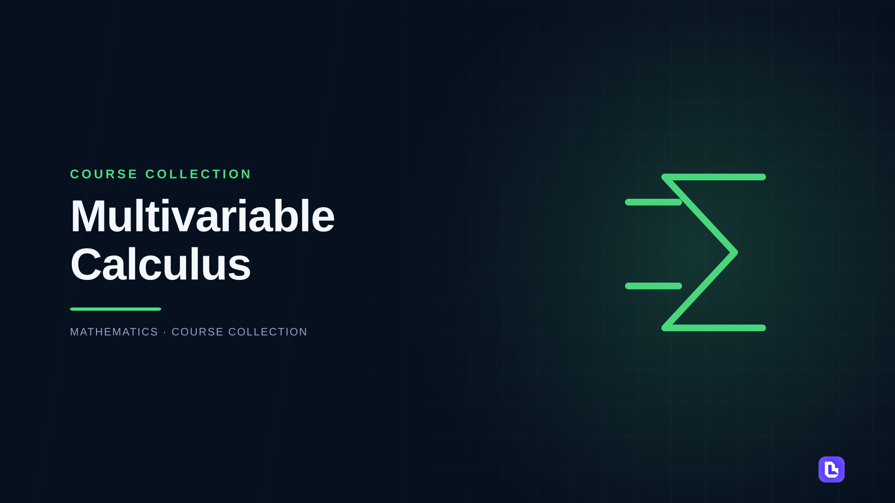</a> 
<a href="catalog/mathematics/math-mvc.md"><strong>Multivariable Calculus</strong></a> 
8 videos · 0 awaiting production
</td>
</tr>
<tr>
<td width="33%" valign="top">

<a href="catalog/mathematics/math-ode.md">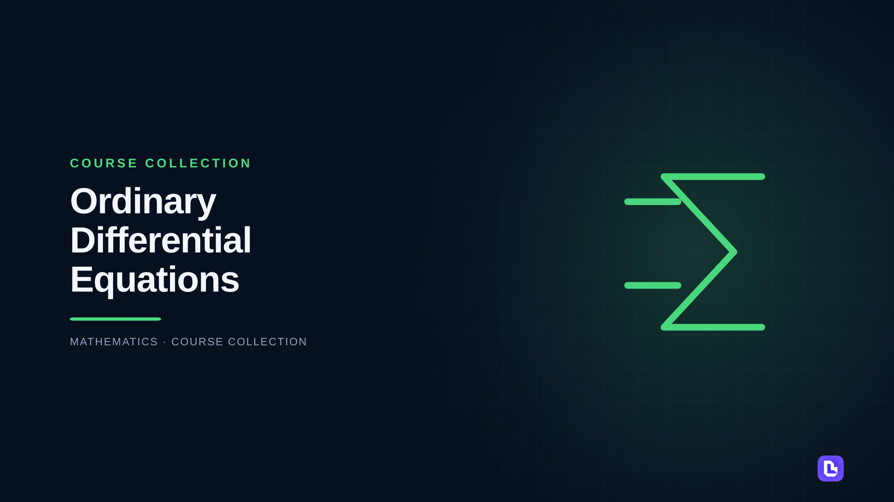</a> 
<a href="catalog/mathematics/math-ode.md"><strong>Ordinary Differential Equations</strong></a> 
8 videos · 0 awaiting production
</td>
<td width="33%" valign="top">

<a href="catalog/mathematics/math-dm.md">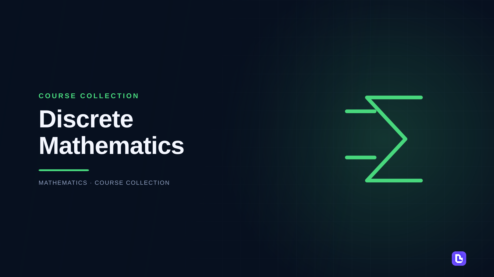</a> 
<a href="catalog/mathematics/math-dm.md"><strong>Discrete Mathematics</strong></a> 
8 videos · 0 awaiting production
</td>
<td width="33%" valign="top">

<a href="catalog/mathematics/math-aa.md">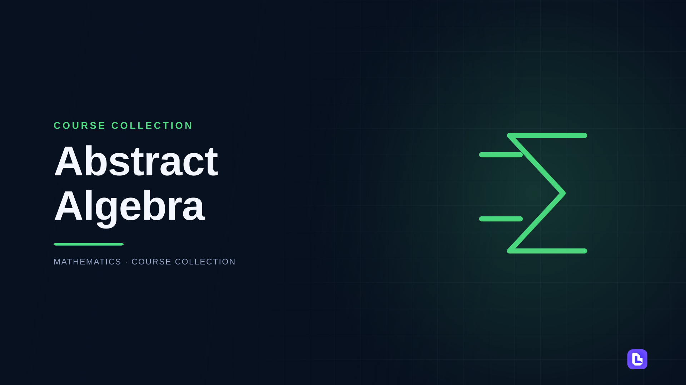</a> 
<a href="catalog/mathematics/math-aa.md"><strong>Abstract Algebra</strong></a> 
8 videos · 0 awaiting production
</td>
</tr>
<tr>
<td width="33%" valign="top">

<a href="catalog/mathematics/math-opt.md">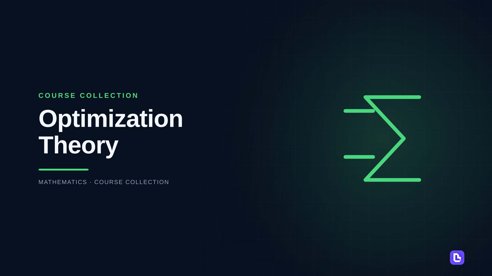</a> 
<a href="catalog/mathematics/math-opt.md"><strong>Optimization Theory</strong></a> 
8 videos · 0 awaiting production
</td>
<td></td>
<td></td>
</tr>
</table>

[Back to subject cards](#browse-the-library)

### Mathematics & Statistics

12 videos · 0 awaiting production

<table>
<tr>
<td width="33%" valign="top">

<a href="catalog/mathematics-statistics/6-041.md">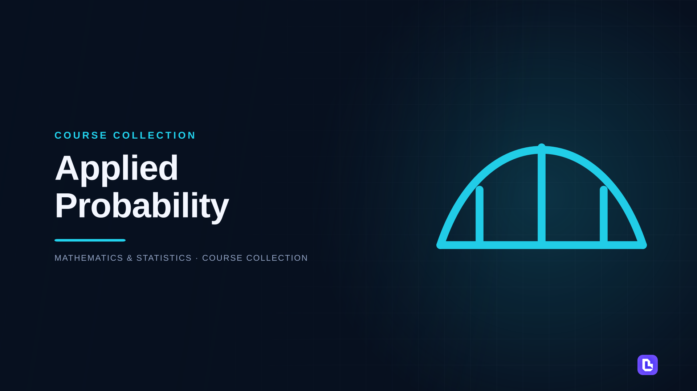</a> 
<a href="catalog/mathematics-statistics/6-041.md"><strong>Applied Probability</strong></a> 
12 videos · 0 awaiting production
</td>
<td></td>
<td></td>
</tr>
</table>

[Back to subject cards](#browse-the-library)

### Physics

0 videos · 25 awaiting production · **No finished videos yet**

<table>
<tr>
<td width="33%" valign="top">

<a href="catalog/physics/8-01.md">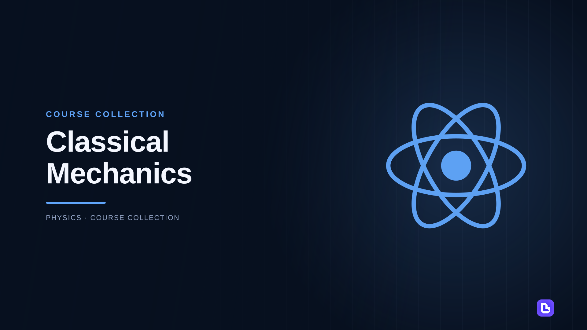</a> 
<a href="catalog/physics/8-01.md"><strong>Classical Mechanics</strong></a> 
0 videos · 13 awaiting production · No finished videos yet
</td>
<td width="33%" valign="top">

<a href="catalog/physics/8-02.md">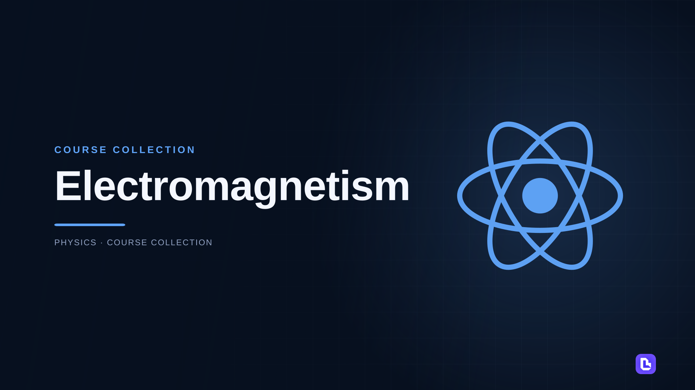</a> 
<a href="catalog/physics/8-02.md"><strong>Electromagnetism</strong></a> 
0 videos · 12 awaiting production · No finished videos yet
</td>
<td></td>
</tr>
</table>

[Back to subject cards](#browse-the-library)

### Chemistry

14 videos · 0 awaiting production

<table>
<tr>
<td width="33%" valign="top">

 
<a href="catalog/chemistry/5-12.md"><strong>Organic Chemistry I</strong></a> 
14 videos · 0 awaiting production
</td>
<td></td>
<td></td>
</tr>
</table>

[Back to subject cards](#browse-the-library)

### Life Sciences

0 videos · 12 awaiting production · **No finished videos yet**

<table>
<tr>
<td width="33%" valign="top">

<a href="catalog/life-sciences/7-013.md">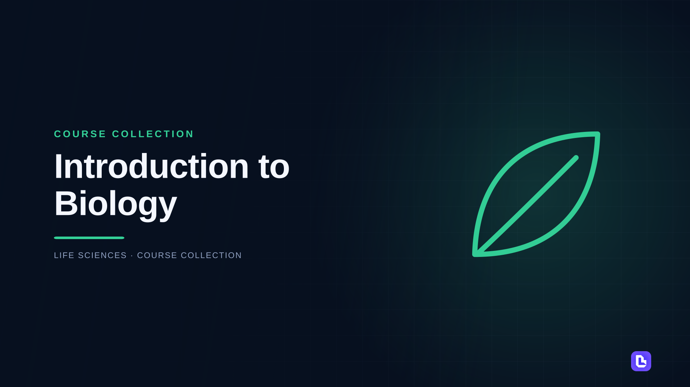</a> 
<a href="catalog/life-sciences/7-013.md"><strong>Introduction to Biology</strong></a> 
0 videos · 12 awaiting production · No finished videos yet
</td>
<td></td>
<td></td>
</tr>
</table>

[Back to subject cards](#browse-the-library)

### Neuroscience

0 videos · 10 awaiting production · **No finished videos yet**

<table>
<tr>
<td width="33%" valign="top">

 
<a href="catalog/neuroscience/9-01.md"><strong>Introduction to Neuroscience</strong></a> 
0 videos · 10 awaiting production · No finished videos yet
</td>
<td></td>
<td></td>
</tr>
</table>

[Back to subject cards](#browse-the-library)

### Psychology

0 videos · 13 awaiting production · **No finished videos yet**

<table>
<tr>
<td width="33%" valign="top">

 
<a href="catalog/psychology/9-00.md"><strong>Introduction to Psychology</strong></a> 
0 videos · 13 awaiting production · No finished videos yet
</td>
<td></td>
<td></td>
</tr>
</table>

[Back to subject cards](#browse-the-library)

### Economics

0 videos · 31 awaiting production · **No finished videos yet**

<table>
<tr>
<td width="33%" valign="top">

 
<a href="catalog/economics/14-01.md"><strong>Principles of Microeconomics</strong></a> 
0 videos · 11 awaiting production · No finished videos yet
</td>
<td width="33%" valign="top">

<a href="catalog/economics/14-02.md">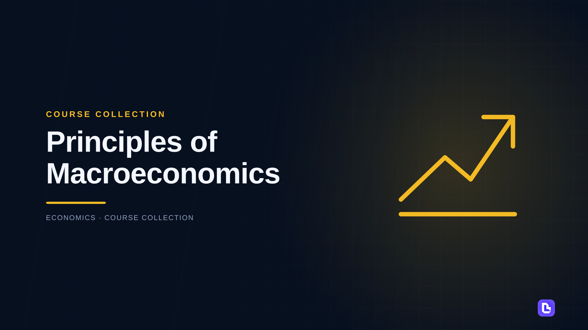</a> 
<a href="catalog/economics/14-02.md"><strong>Principles of Macroeconomics</strong></a> 
0 videos · 8 awaiting production · No finished videos yet
</td>
<td width="33%" valign="top">

 
<a href="catalog/economics/econ-159.md"><strong>Game Theory</strong></a> 
0 videos · 12 awaiting production · No finished videos yet
</td>
</tr>
</table>

[Back to subject cards](#browse-the-library)

### Finance

0 videos · 12 awaiting production · **No finished videos yet**

<table>
<tr>
<td width="33%" valign="top">

 
<a href="catalog/finance/econ-252.md"><strong>Financial Markets</strong></a> 
0 videos · 12 awaiting production · No finished videos yet
</td>
<td></td>
<td></td>
</tr>
</table>

[Back to subject cards](#browse-the-library)

### Political Science

0 videos · 14 awaiting production · **No finished videos yet**

<table>
<tr>
<td width="33%" valign="top">

 
<a href="catalog/political-science/plsc-114.md"><strong>Introduction to Political Philosophy</strong></a> 
0 videos · 14 awaiting production · No finished videos yet
</td>
<td></td>
<td></td>
</tr>
</table>

[Back to subject cards](#browse-the-library)

### Philosophy

0 videos · 10 awaiting production · **No finished videos yet**

<table>
<tr>
<td width="33%" valign="top">

 
<a href="catalog/philosophy/phil-176.md"><strong>Philosophy of Death</strong></a> 
0 videos · 10 awaiting production · No finished videos yet
</td>
<td></td>
<td></td>
</tr>
</table>

[Back to subject cards](#browse-the-library)

### Literature

0 videos · 10 awaiting production · **No finished videos yet**

<table>
<tr>
<td width="33%" valign="top">

 
<a href="catalog/literature/amst-246.md"><strong>American Modernist Literature</strong></a> 
0 videos · 10 awaiting production · No finished videos yet
</td>
<td></td>
<td></td>
</tr>
</table>

[Back to subject cards](#browse-the-library)

### Astronomy

12 videos · 0 awaiting production

<table>
<tr>
<td width="33%" valign="top">

 
<a href="catalog/astronomy/astr-160.md"><strong>Frontiers and Controversies in Astrophysics</strong></a> 
12 videos · 0 awaiting production
</td>
<td></td>
<td></td>
</tr>
</table>

[Back to subject cards](#browse-the-library)

### Embedded Systems

8 videos · 0 awaiting production

<table>
<tr>
<td width="33%" valign="top">

<a href="catalog/embedded-systems/es-mcu.md">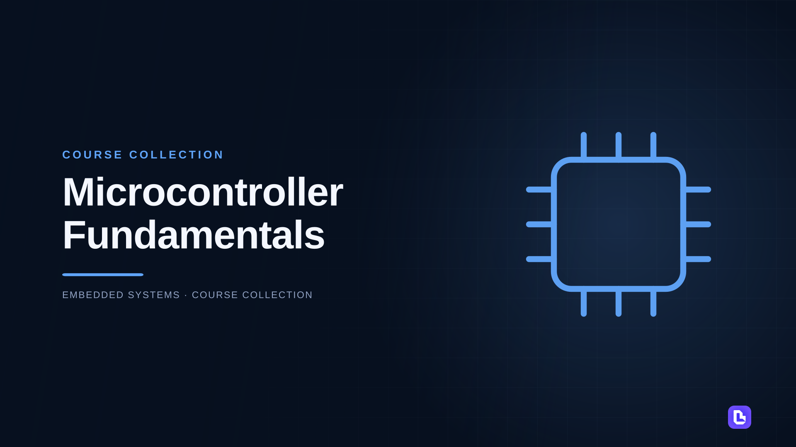</a> 
<a href="catalog/embedded-systems/es-mcu.md"><strong>Microcontroller Fundamentals</strong></a> 
4 videos · 0 awaiting production
</td>
<td width="33%" valign="top">

<a href="catalog/embedded-systems/es-rtos.md">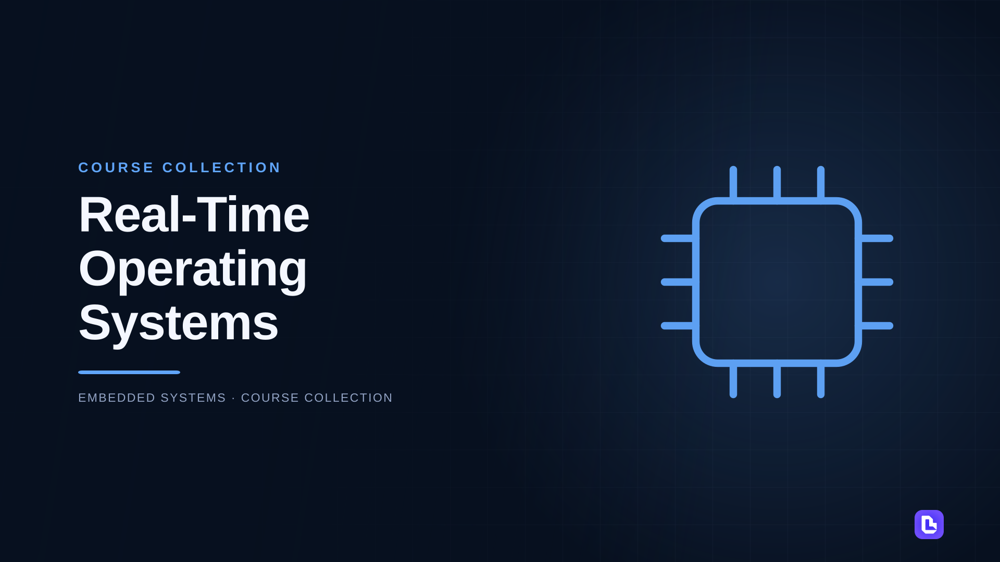</a> 
<a href="catalog/embedded-systems/es-rtos.md"><strong>Real-Time Operating Systems</strong></a> 
4 videos · 0 awaiting production
</td>
<td></td>
</tr>
</table>

[Back to subject cards](#browse-the-library)

### Digital Electronics

9 videos · 0 awaiting production

<table>
<tr>
<td width="33%" valign="top">

 
<a href="catalog/digital-electronics/de-dld.md"><strong>Digital Logic Design</strong></a> 
5 videos · 0 awaiting production
</td>
<td width="33%" valign="top">

 
<a href="catalog/digital-electronics/de-fpga.md"><strong>FPGA Fundamentals</strong></a> 
4 videos · 0 awaiting production
</td>
<td></td>
</tr>
</table>

[Back to subject cards](#browse-the-library)

## Repository layout

`catalog/` course pages and full index · `assets/` videos, previews, Prompts and source kits · `data/` final records · `docs/` reuse and verification · `scripts/` production, publishing and tests.

## Recent changes

- 2026-09-30T08:01:25+00:00 — Rebuilt the seven other requested terminology corrections; clarified the null-plane slice, corrected left-null cross-section and projection axis scales, removed projection formula overlap, and separated the SN1 proton label.
- 2026-09-30T07:42:10+00:00 — C05-A002 v2: repaired 16-second formula overlap, rebuilt video and cover, replaced stale Manim/15-second Prompt with actual Remotion/30-second instructions; new native attachment uploaded.
- 2026-09-30T07:42:10+00:00 — Corrected eight catalog terms without changing IDs or slugs; separated generation/review/publication; measured all 299 available MP4 files.

## Use and contribute

See [reuse instructions](docs/REUSE.md), [rights requiring confirmation](docs/RIGHTS.md), and [contribution instructions](.github/CONTRIBUTING.md). Report a concept error with its stable ID, video version and timestamp, or suggest a topic in [Issues](https://github.com/LeaddeOpenLab/leadde-knowledge-in-motion/issues/new/choose).

[Leadde animation tools](https://leadde.ai/animation) explains available creation tools. Prompts are copied manually; there is no automatic prompt transfer.

The static website can be served locally with `python3 -m http.server 8000`. No public site deployment is claimed.
