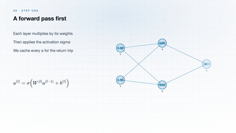

# Neural Network Training Explained Visually

[All learning paths](../LEARNING-PATHS.md) · [Library home](../../README.md)

Neural network training connects predictions, a loss function, gradient computation and parameter updates. This sequence starts with a single neuron, explains how backpropagation calculates gradients, and separates that calculation from the optimizer's update. The final video shows how validation measures performance without training on the validation examples.

Trace the backward flow of gradients, then connect it to loss, parameter updates and validation.

[Watch Backpropagation](../../catalog/artificial-intelligence/6-036.md#c03-a009)

**Who this is for:** Students beginning machine learning and developers trying to understand a training loop. Familiarity with functions, basic derivatives and simple Python code will help with the later videos.

## What you will learn

- Connect neuron outputs and activation functions to a batch loss.
- Distinguish the chain rule, backpropagation and gradient descent.
- Explain the roles of optimizer steps, learning-rate schedules and validation.

## Watch in order

Follow these 8 videos in sequence. Each link opens the concept on its course page, with the video, download link and animation Prompt.

### 1. Artificial Neuron

A neuron combines inputs using weights and a bias, then applies an activation function. Trace the weighted sum to its output before considering how many such units connect into a network.

[Watch Artificial Neuron](../artificial-intelligence/ai-dl.md#c26-a001)

### 2. Activation Functions

Activation functions introduce nonlinearity and affect how gradients pass through a network. Compare the functions' shapes and slopes, especially where their derivatives become small or zero.

[Watch Activation Functions](../artificial-intelligence/ai-dl.md#c26-a002)

### 3. Loss Reduction Across a Batch

Training commonly combines per-example losses into a single sum or mean. Watch how this reduction changes the scale of the loss and gradients, and why unequal batch sizes matter when combining averages.

[Watch Loss Reduction Across a Batch](../artificial-intelligence/ai-dl.md#c26-a018)

### 4. Chain rule

The chain rule connects a change at the start of a composed function to its effect at the end. Follow the product of local derivatives; this is the central calculation used along a path during backpropagation.

[Watch Chain rule](../artificial-intelligence/6-036.md#c03-a010)

### 5. Backpropagation

Backpropagation applies the chain rule backward through the computation to obtain gradients for the parameters. Compare the forward computation with the backward sweep. Computing those gradients is separate from updating the weights.

[Watch Backpropagation](../artificial-intelligence/6-036.md#c03-a009)

### 6. Gradient descent

Gradient descent updates parameters in the direction opposite the gradient. Watch how the learning rate changes the step size and why an overly large step can overshoot rather than steadily reduce the loss.

[Watch Gradient descent](../artificial-intelligence/6-036.md#c03-a003)

### 7. Optimizer Step and Learning-Rate Schedule

The optimizer uses gradients, its state and a learning rate to update parameters. A schedule changes the learning rate over training. Track the parameter movement separately from the curve controlling the scale of future steps.

[Watch Optimizer Step and Learning-Rate Schedule](../artificial-intelligence/ai-dl.md#c26-a019)

### 8. PyTorch Validation Loop and Metric Tracking

Validation evaluates held-out examples without parameter updates. Observe evaluation mode, disabled gradient recording and accumulated metrics as separate operations, then connect the final metric to model selection.

[Watch PyTorch Validation Loop and Metric Tracking](../artificial-intelligence/ai-dl.md#c26-a025)

## Continue learning

- [Pointers and Memory Explained Visually](pointers-and-memory-explained-visually.md)
- [LLMs and RAG Explained Visually](llms-and-rag-explained-visually.md)

[Browse the full concept index](../INDEX.md)
