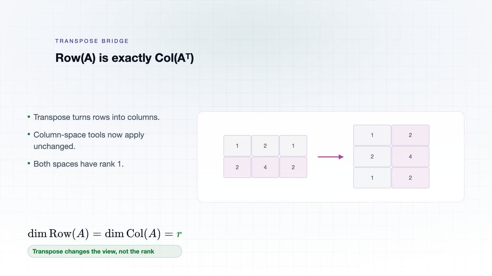
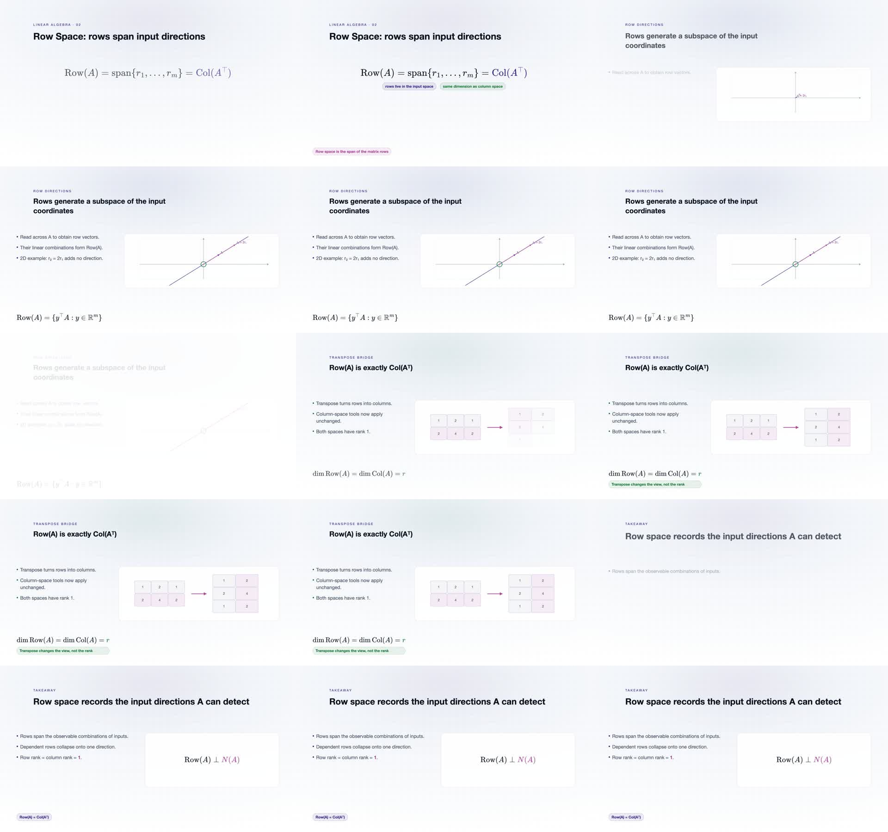

# C05-A002 v2 review — 2026-09-30

Reviewer: Codex (AI-assisted source and visual inspection; not a human subject-expert certification).

Source: `sources/linear-algebra/src/videos/la02-line-space.tsx`. The previous transpose scene placed the rank formula using `marginTop: 168` beside absolutely positioned explanatory lines. v2 moves the formula to the footer, below the explanation. The title is now Row Space. The vector diagram is explicitly described as a 2D example, distinct from the later 2×3 matrix.

Measured output: 900 frames at 30 fps, 30 video seconds (container duration about 30.06 s), 1920×1080, H.264 MP4. Inspected 15 samples at two-second intervals, including stable and transition samples; inspected 16 seconds at native resolution and 640×360 reading size. Checked dependent rows, transpose dimensions, rank 1, Row(A)=Col(Aᵀ) and row/null-space orthogonality against source. Reviewed the independently rendered Row Space cover. No blocking overlap observed in these samples. This is not an assertion that every frame was manually inspected.

The public Prompt now describes the actual four-scene, 30-second Remotion production. The obsolete 15-second Manim request is retained only as `requirement_prompt` / version history. Source and dependencies are packaged; pixel-identical reproduction on a clean machine is not tested.
