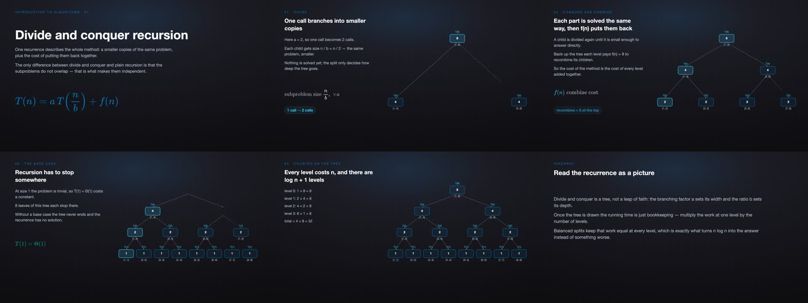
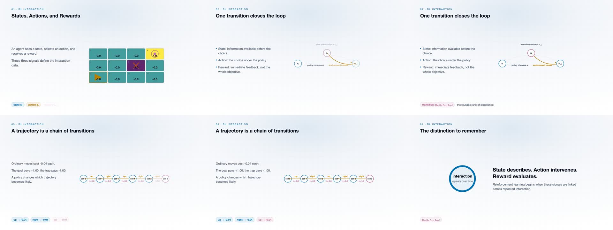
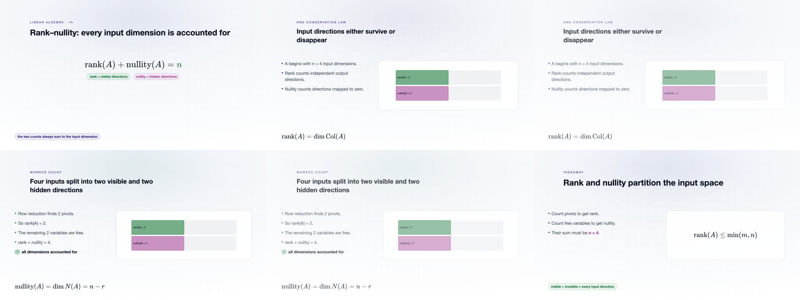

# Featured-video inspection — 2026-09-30

Reviewer: Codex (AI-assisted inspection). Selection used the actual MP4 metadata and six sampled frames at 640×360 per video, spanning the instructional sequence. This selection is not a full teaching review; these historical entries remain `partially_checked`, not `passed`.

- C02-A001: recursion tree, splitting, combining, base case and per-level work. The n log n conclusion belongs to the illustrated balanced recurrence, not all divide-and-conquer algorithms.
- C29-A001: state/action/reward loop and trajectory. Small diagram labels may require full-screen playback.
- C05-A014: rank plus nullity accounts for n input dimensions; the example uses rank 2, nullity 2, n=4.

C03-A001 was inspected but not featured: the decision-rule formula near 10 seconds has poor contrast on its light background and is recorded for revision.
