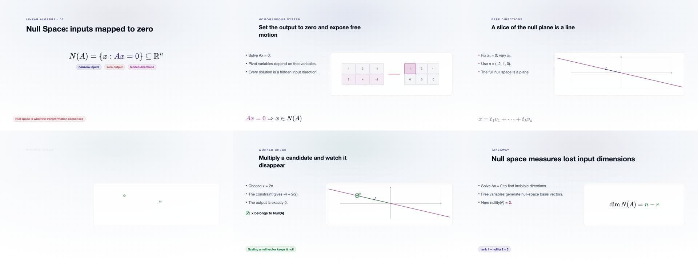
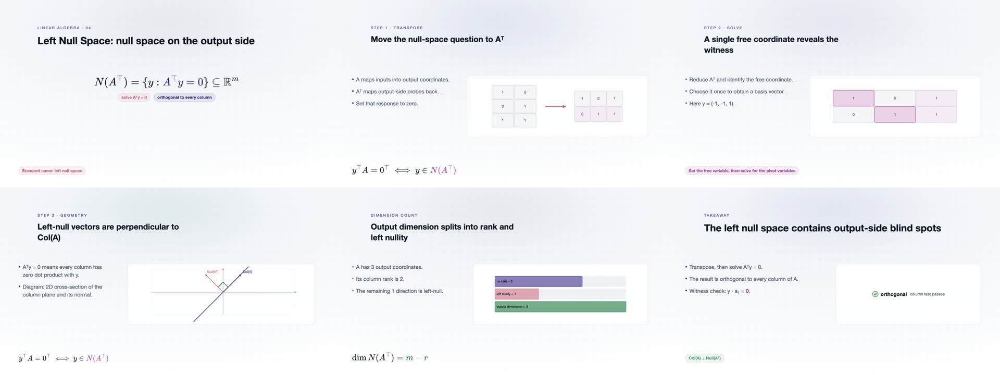
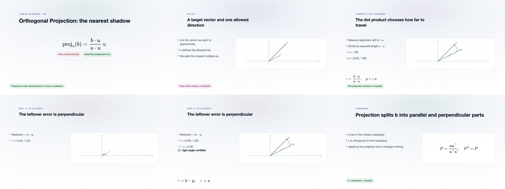
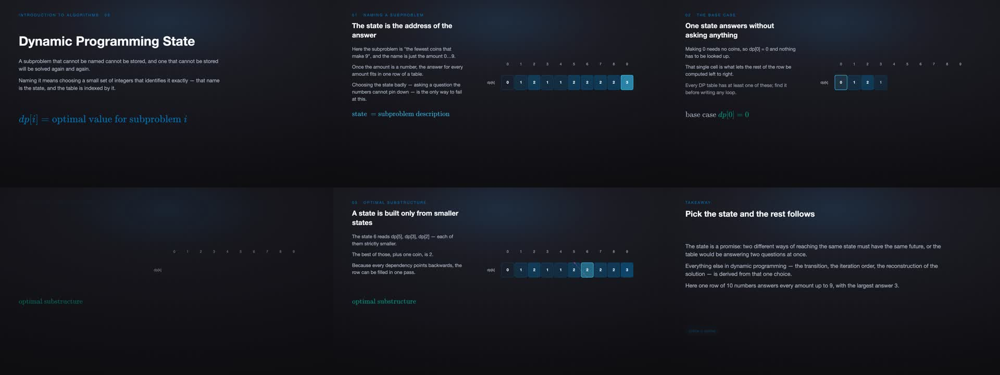
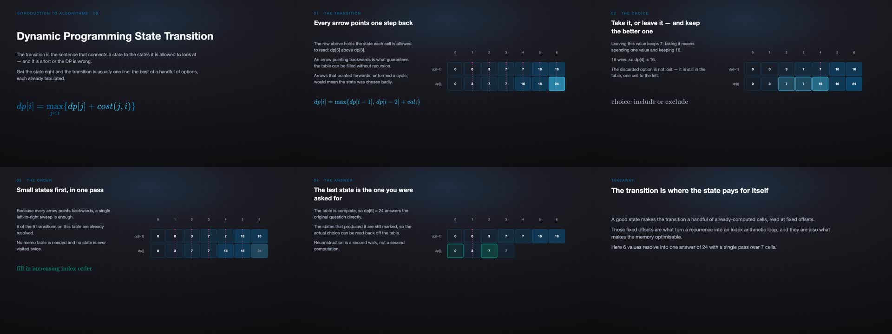
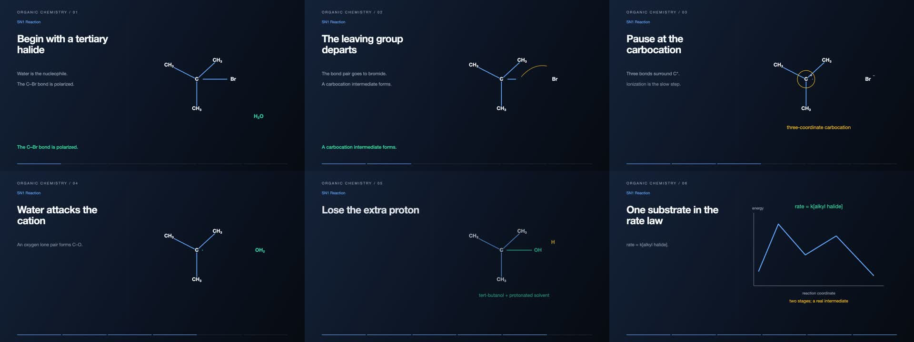
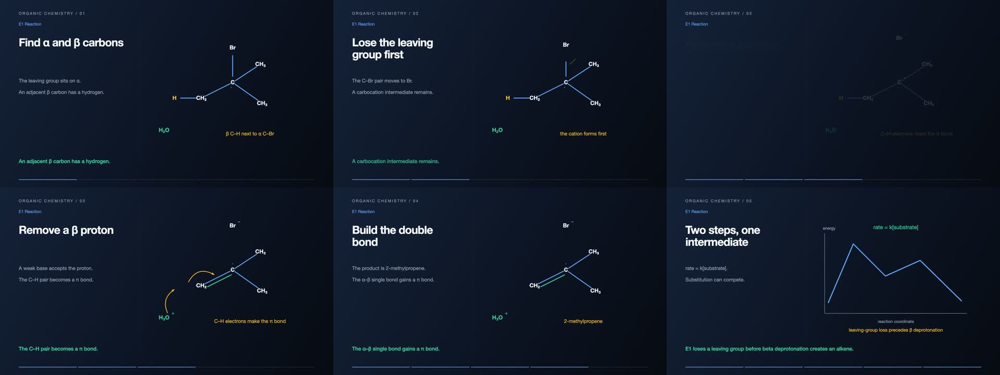

# Seven terminology revisions — 2026-09-30

Reviewer: Codex (AI-assisted source, formula/numeric and visual inspection). Each item was rendered from its actual course source; six MP4 samples spanning stable/transition frames were inspected at 640×360. Covers and final Prompts were checked separately. This records the scope actually performed, not a human subject-expert or exhaustive frame-by-frame certification.

- **C05-A003, Null Space:** identifies the pictured line as the x₃=0 slice of a null plane. The 2×3 rank-1 example has nullity 2. Clarifies that free variables generate basis vectors rather than being vectors themselves.
- **C05-A004, Left Null Space:** labels the 2D cross-section of a 3D column plane and its normal, uses equal axis scales, and replaces an unrelated input-space formula with the left-null condition.
- **C05-A005, Orthogonal Projection:** moves the coefficient formula below the copy, describes u·u as squared length, uses equal axis scales so orthogonality is visible, and suppresses numerical −0.00.
- **C02-A008, Dynamic Programming State:** standard term now appears on the video and cover; minimum-coin subproblem/amount and base case match the public Prompt.
- **C02-A009, Dynamic Programming State Transition:** standard term appears on video and cover; take/skip dependencies, fill order and final 24 match the public Prompt.
- **C09-A009, SN1 Reaction:** correct terminology; departing proton label separated from OH. Source and Prompt show ionization, carbocation, water attack and deprotonation.
- **C09-A011, E1 Reaction:** correct terminology; source and Prompt show leaving-group loss followed by beta deprotonation and alkene formation.

Sources and dependencies are included under `assets/sources/`. Clean-machine pixel-identical reproduction was not tested. References linked in the records support terminology and concepts; no textbook page numbers or human reviewers were invented.

